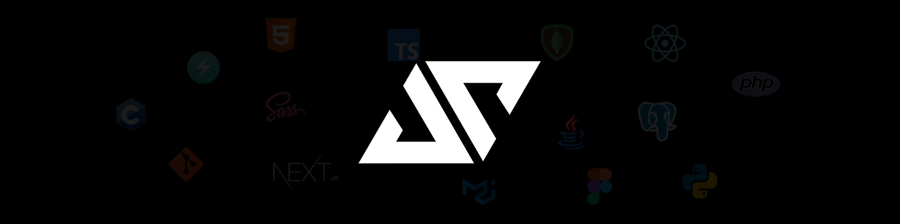

<h1 align="center">Hi, thanks for visiting my profile!</h1>

  
  
  
    
    
    

I'm Arhun Saday, also known as Jeusto. I've been close to a computer since an early age and been passionate about it since then. I've been doing graphic design and 3D modeling as a hobby for a few years. Fast forward to today, I study computer science and maths at the University of Strasbourg in France.

I do programming in various languages and technologies including Typescript, React, Nextjs, Python, Java and more. I try to learn and get better every single day. I especially love designing and building interesting & useful stuff with code.

🚀 Exploring opportunities and side projects.

🏫 Currently a student at the University of Strasbourg in France.

💻 Check out my website to see all of my projects: <a href="https://jeusto.me">jeusto.me</a>

🕊 Get in touch with me on <a href="https://twitter.com/jeustoo">Twitter</a> or through <a href="mailto:arhunsad@gmail.com">email
