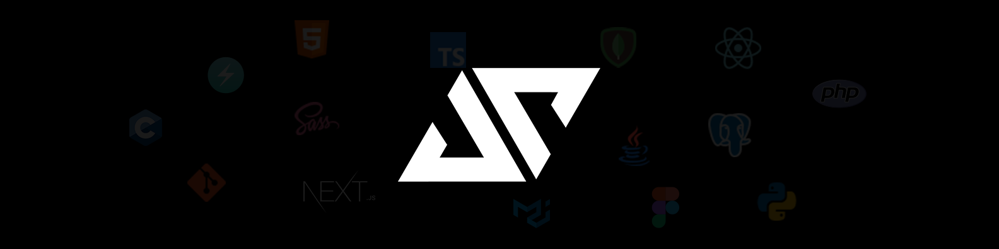

<h1 align="center">Hi, thanks for visiting my profile 👋</h1>

I'm Arhun Saday, also known as Jeusto. I've been close to a computer since an early age and been passionate about it since then.   

I've been doing graphic design and 3D modeling as a hobby for a few years. Fast forward to today, I study computer science and maths at the University of Strasbourg in France.

I do programming in various languages and technologies including Typescript, React, Nextjs, Python, Java and more. I try to learn and get better every single day. I especially love designing and building interesting & useful stuff with code.

